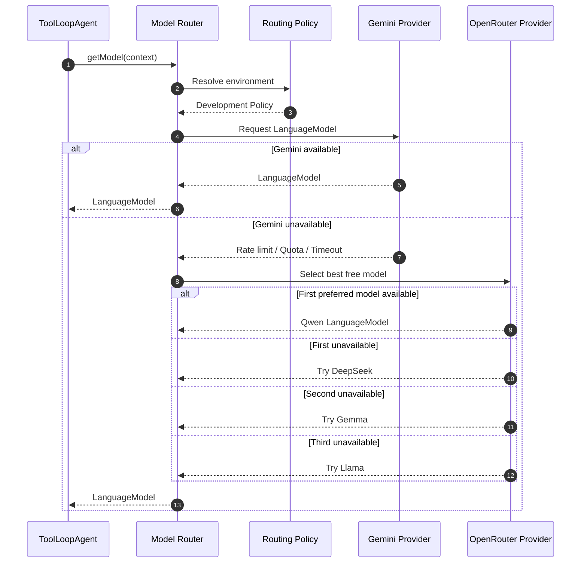

# Provider-Agnostic Model Router Architecture

# Purpose

The Model Router is responsible for selecting the most appropriate AI model for the current execution.

Its responsibility is **routing only**.

It is NOT responsible for:

- reasoning
- agent execution
- prompt construction
- tool execution
- conversation management
- persistence
- retries performed by the agent
- E2B interaction
- Inngest orchestration

The router exists solely to hide all provider-specific details from the rest of the application.

---

# Core Philosophy

The application should never know:

- which provider is being used
- which SDK is being used
- which model is currently selected
- whether failover occurred

The rest of the application simply asks:

```ts
const model = await modelRouter.getModel(context);
```

and receives a valid AI SDK LanguageModel instance.

Nothing else.

---

# Architectural Goal

The architecture must remain provider agnostic.

Future providers should be added without changing:

- ToolLoopAgent
- Inngest
- tRPC
- Tools
- Frontend

Only the router should change.

---

# High-Level Architecture

```
                        ToolLoopAgent
                              │
                              ▼
                    Model Router (API)
                              │
                              ▼
                    Routing Policy Engine
                              │
        ┌─────────────────────┴─────────────────────┐
        ▼                                           ▼
 Development Policy                         Production Policy
        │                                           │
        ▼                                           ▼
 Provider Strategy                         Provider Strategy
        │                                           │
        ▼                                           ▼
 Gemini / OpenRouter                        OpenAI / Future
        │
        ▼
 Model Selection Policy
        │
        ▼
 LanguageModel
```

---

# Routing Sequence Diagram



The router remains provider-agnostic and never exposes which provider or model was selected.

---

# Responsibilities

The Model Router is responsible for:

- environment-aware routing
- provider selection
- model selection
- provider failover
- provider initialization
- model initialization
- provider abstraction
- future routing policies

The router must never execute prompts.

---

# Routing Flow

Every request follows this sequence:

1. Receive execution context.
2. Determine current environment.
3. Load routing policy.
4. Select provider.
5. Verify provider availability.
6. Select model.
7. Return LanguageModel.

The router never performs generation.

---

# Environment Policy

The first routing decision is the current environment.

```
Environment

↓

Development

or

Production
```

Each environment has its own routing strategy.

---

# Development Strategy

Development prioritizes:

- zero cost
- free providers
- automatic failover
- easy debugging

Primary provider:

Gemini Free Tier

Fallback provider:

OpenRouter

---

# Production Strategy

Production prioritizes:

- reliability
- capability
- user configuration
- billing

Initially production may simply use:

OpenAI

Later this can evolve into a capability-based routing system.

---

# Provider Strategy

Every environment defines an ordered list of providers.

Example:

Development

1. Gemini
2. OpenRouter

Production

1. OpenAI

The router always tries providers in order.

---

# Provider Availability

The router should never assume a provider is available.

A provider may become unavailable because of:

- rate limiting
- quota exhaustion
- temporary outage
- authentication failure
- timeout
- network error
- server error

The router should treat all of these as:

"This provider cannot satisfy the current request."

---

# Provider Failover

If the primary provider cannot satisfy the request:

```
Gemini

↓

Unavailable

↓

OpenRouter
```

The ToolLoopAgent should never know this happened.

Failover must be completely transparent.

---

# OpenRouter Strategy

OpenRouter is itself treated as a provider.

Internally it owns multiple models.

Example:

```
OpenRouter

↓

Preferred Models

↓

Qwen

↓

DeepSeek

↓

Gemma

↓

Llama
```

Only free models should be considered during development.

---

# Model Ranking

The router should maintain an ordered list of preferred free models.

Example:

1. Qwen
2. DeepSeek
3. Gemma
4. Llama

The router selects the highest-ranked available model.

If one model becomes unavailable:

```
Qwen

↓

Unavailable

↓

DeepSeek

↓

Unavailable

↓

Gemma
```

No application code changes.

---

# Why Static Ranking?

The router should NOT fetch the OpenRouter model catalog on every request.

Reasons:

- unnecessary latency
- additional HTTP requests
- additional failure point
- unpredictable ordering

Instead:

Maintain a curated list.

Later the list may be refreshed automatically by a scheduled background job.

---

# Provider Abstraction

Every provider should implement the same interface.

Conceptually:

```
Provider

↓

getModel()

↓

LanguageModel
```

Every provider hides:

- SDK
- API keys
- Base URL
- Headers
- Initialization

The router never knows implementation details.

---

# Routing Context

The router should receive an execution context.

Future examples:

- environment
- requested capability
- preferred provider
- user tier
- feature flags

The initial implementation only requires:

```
environment
```

The API should be designed to grow naturally.

---

# Returned Object

The router should always return:

```
LanguageModel
```

It should never return:

- API keys
- provider configuration
- provider metadata
- SDK instances

Only a usable LanguageModel.

---

# Separation of Responsibilities

Frontend

Responsible for:

- user interaction

---

tRPC

Responsible for:

- validation
- background job creation

---

Inngest

Responsible for:

- workflow orchestration

---

ToolLoopAgent

Responsible for:

- reasoning
- planning
- tool execution

---

Model Router

Responsible for:

- selecting the LanguageModel

---

Providers

Responsible for:

- SDK initialization

---

Language Model

Responsible for:

- reasoning only

---

# Future Extensions

The architecture should support:

- capability routing
- vision models
- reasoning models
- long-context models
- premium user routing
- cost-aware routing
- latency-aware routing
- automatic provider health monitoring
- scheduled provider ranking updates
- A/B model testing

without changing the public API.

---

# Public API

The public API should remain extremely small.

Example:

```ts
const model = await modelRouter.getModel(context);
```

This API should remain stable even as new providers, models, and routing strategies are added.

---

# Design Principles

1. The router owns routing.
2. The agent owns reasoning.
3. Providers own SDK initialization.
4. Models own inference.
5. The application never knows which provider is active.
6. Failover must be transparent.
7. Routing policies should be replaceable.
8. The router should remain small.
9. The public API should rarely change.
10. Every future provider should be added without modifying the ToolLoopAgent.

---

# Final Mental Model

The Model Router should be viewed as a policy-driven routing engine rather than a collection of provider SDKs.

Its purpose is not to generate AI responses.

Its purpose is to answer one question:

> "Given the current execution context, what is the best LanguageModel available right now?"

Everything else belongs somewhere else.