```mermaid
sequenceDiagram
    autonumber

    participant Comp as Client Component
    participant TQ as TanStack Query
    participant TC as tRPC Client
    participant TS as tRPC Server (API Route)
    participant SH as Server Handler
    participant DB as Database

    rect rgb(25,25,25)
    Note over Comp,DB: Flow 1 — Client-side query/mutation
    Comp->>TQ: useQuery / useMutation
    Note right of Comp: src/app/page.tsx
    TQ->>TC: invoke procedure
    TC->>TS: HTTP POST /api/trpc --- network ---
    Note right of TS: src/app/api/trpc/[trpc]/route.ts
    TS->>SH: fetchRequestHandler → appRouter → procedure
    Note right of SH: src/trpc/routers/_app.ts + project.ts
    SH->>DB: prisma / inngest.send
    DB-->>SH: result
    SH-->>TS: { success: true }
    TS-->>TC: JSON response
    TC-->>TQ: data
    TQ-->>Comp: cache + re-render
    end

    participant RSC as React Server Component
    participant QC as QueryClient (server)
    participant TSC as tRPC Server Caller
    participant SH2 as Server Handler
    participant DB2 as Database
    participant CL as Client Layer (hydrated)

    rect rgb(20,35,20)
    Note over RSC,CL: Flow 2 — Server-side prefetch + hydration
    Note right of RSC: Server Component (no "use client")
    RSC->>QC: getQueryClient() [server.tsx]
    Note right of QC: src/trpc/server.tsx + query-client.ts
    RSC->>TSC: prefetchQuery(trpc.x.queryOptions())
    TSC->>SH2: call resolver directly (no network)
    SH2->>DB2: query
    DB2-->>SH2: rows
    SH2-->>TSC: result
    TSC-->>QC: populate cache
    RSC->>RSC: dehydrate(QC) [superjson]
    RSC->>CL: <HydrationBoundary state={dehydratedState}>
    CL->>QC: hydrate() on mount
    Note right of CL: useQuery reads from cache, no refetch
    end
```

# tRPC Architecture — Complete Learning Curriculum

**Project:** Vibe (Next.js 15 + React 19 + tRPC v11 + AI SDK v7 + Inngest + E2B)
**Status:** Units 1–6 complete, remaining units TBD
**Approach:** Divide and conquer — one unit at a time, deep understanding, active recall

---

## Table of Contents

- [Curriculum Overview](#curriculum-overview)
- [Unit 1 — The Browser/Server Boundary](#unit-1--the-browserserver-boundary)
- [Unit 2 — Compile-Time vs Runtime](#unit-2--compile-time-vs-runtime)
- [Unit 3 — Remote Procedure Call (RPC)](#unit-3--remote-procedure-call-rpc)
- [Unit 4 — The Fluent Builder Pattern (Standalone Deep Dive)](#unit-4--the-fluent-builder-pattern-standalone-deep-dive)
- [Unit 5 — tRPC's Fluent Builder](#unit-5--trpcs-fluent-builder-connecting-the-pattern)
- [Unit 6 — Context and Dependency Injection](#unit-6--context-and-dependency-injection)
- [Sequence Diagram: Complete Flow](#sequence-diagram-complete-flow)

---

## Curriculum Overview

This curriculum evolved organically as we studied the codebase. The original abstract roadmap (44 units across 10 layers) was replaced with the **actual units taught**, which reflect what the codebase actually requires understanding.

### Completed Units
1. **The Browser/Server Boundary** — HTTP, serialization, network isolation
2. **Compile-Time vs Runtime** — TypeScript erasure, Zod validation
3. **Remote Procedure Call (RPC)** — RPC vs REST, tRPC architecture
4. **The Fluent Builder Pattern** — immutable builders, sealed objects (standalone theory)
5. **tRPC's Fluent Builder** — mapping the pattern to `baseProcedure.input().mutation()`
6. **Context and Dependency Injection** — `createTRPCContext`, per-request injection

### Upcoming Units (planned)
7. Context in procedure handlers
8. Authentication & authorization in tRPC
9. Error handling in tRPC procedures
10. SuperJSON serialization deep dive
11. The tRPC HTTP adapter internals
12. Client-side tRPC integration with React
13. TanStack Query deep dive
14. Server-side rendering with tRPC
15. Dehydration and hydration pipeline
16. Full end-to-end architecture trace

---

## Unit 1 — The Browser/Server Boundary

### Status: ✅ Complete

### 1. The problem

Your React component runs in the user's browser. Your server code runs on a server. They don't share memory, variables, or a JavaScript runtime. **The only bridge is HTTP.**

**What problem are we trying to solve?** How does code running in the browser invoke code running on the server, get a result back, and make it feel like a normal function call?

### 2. Human explanation

Think about calling a function in the same codebase:

```ts
const result = await buildProject("abc-123", "Build a landing page");
```

This is simple because:
- You know the function exists
- You know what arguments it accepts
- You know what it returns
- The function is right there — no network, no serialization

But your React component and your server function are on **different computers**. They don't share memory. The only way to communicate is over the network.

**HTTP is the universal protocol** because:
- It's text-based (human readable, debuggable)
- It's stateless (each request is independent)
- It's universally supported (every language, every platform)
- It works through firewalls and proxies

The cost: **every piece of data crossing that boundary must be serialized to text (usually JSON) and deserialized back.**

### 3. Tiny example

**Server (Node.js, port 3001):**
```js
const http = require('http');

const server = http.createServer((req, res) => {
  if (req.url === '/build' && req.method === 'POST') {
    let body = '';
    req.on('data', chunk => body += chunk);
    req.on('end', () => {
      const { prompt } = JSON.parse(body);
      res.writeHead(200);
      res.end(JSON.stringify({ success: true, previewUrl: 'https://...' }));
    });
  }
});

server.listen(3001);
```

**Client (browser):**
```js
fetch('/build', {
  method: 'POST',
  headers: { 'Content-Type': 'application/json' },
  body: JSON.stringify({ prompt: 'Build a landing page' }),
})
  .then(res => res.json())
  .then(data => console.log(data.previewUrl));
```

**What's happening:**
1. Client turns `{ prompt: '...' }` into a JSON string
2. Sends it as the body of an HTTP POST
3. Server receives raw text, parses it with `JSON.parse()`
4. Server does work, turns the result into a JSON string
5. Client receives raw text, parses it with `.json()`

### 4. What is actually happening (mechanics)

Step by step, the raw HTTP flow:

1. **Client creates a request:** Browser constructs an HTTP message with a method, URL, headers, and a stringified body.
2. **Network transport:** TCP/IP carries the bytes to the server.
3. **Server receives bytes:** Node.js parses the HTTP message into a `req` object.
4. **Server reads the body:** Since HTTP sends text, the server must accumulate chunks and parse them (`JSON.parse(body)`).
5. **Server processes:** Business logic runs — database calls, AI agents, whatever.
6. **Server serializes the response:** `JSON.stringify(result)` turns the result into text.
7. **Response travels back:** TCP/IP carries bytes to the browser.
8. **Client parses the response:** `res.json()` turns the text back into a JS object.

**Two critical transformations happen:**
- **Serialization** (JS object → string) on the way out
- **Deserialization** (string → JS object) on the way in

Both sides must agree on the format. If the server sends `{ success: true }` and the client expects `{ ok: true }`, you have a silent bug.

### 5. Connect it to OUR codebase

In our project, this raw HTTP dance happens at **one specific point**:

**File: `src/app/api/trpc/[trpc]/route.ts`**
```ts
const handler = (req: Request) =>
  fetchRequestHandler({
    endpoint: '/api/trpc',
    req,
    router: appRouter,
    createContext: createTRPCContext,
  });

export { handler as GET, handler as POST };
```

This is a **Next.js Route Handler**. When a POST request hits `/api/trpc` (or any subpath like `/api/trpc/project.build`), Next.js hands the raw `Request` object to `fetchRequestHandler`.

Everything above this line — the React component, the button click, the `useMutation` call — eventually becomes an HTTP request that lands here.

Everything below this line — `fetchRequestHandler` — is the tRPC library's job. It takes that raw HTTP request and converts it into a procedure invocation.

**What you should notice right now:** Our code at this layer is incredibly thin. We don't manually parse JSON bodies, we don't manually stringify responses, we don't check Content-Type headers. `fetchRequestHandler` handles all of that. We just declare what router to use and how to create context.

### 6. What would happen WITHOUT it?

If we removed HTTP entirely and tried to make the browser call the server directly... **it's impossible**. The browser simply cannot execute Node.js code. There is no API for it. The browser's JavaScript runtime (V8, isolated in a tab) and the server's runtime are physically separate processes, often on different machines.

Even if they were on the same machine, they're separate processes with separate memory heaps. The only communication channel is the operating system's networking stack.

HTTP is the universal protocol because it's text-based, stateless, universally supported, and works through firewalls/proxies.

Without HTTP (or something like it), your browser and server are two ships passing in the night.

### 7. Mental model

> **The browser and server are two separate worlds. HTTP is the only bridge. Every piece of data that crosses that bridge must be serialized to text (usually JSON) and deserialized back.**

### 8. Common confusion

**"If I use TypeScript on both client and server, why isn't the data automatically type-safe across the network?"**

Because TypeScript types are **erased at runtime**. They exist only during development, in your editor and build tool. The JavaScript that runs in the browser has no types. The JavaScript that runs on the server has no types. The JSON string traveling over HTTP definitely has no types.

TypeScript catches mistakes at build time. It cannot catch a client sending `{ projectId: 123 }` instead of `{ projectId: "abc" }` — because by the time that data exists, it's just JSON. That's why we need **runtime validation** (Zod) in addition to TypeScript.

### 9. Tiny exercise

Imagine your server has this function:

```js
async function buildProject(projectId, prompt) {
  const sandbox = await createSandbox();
  const result = await runAgent(sandbox, prompt);
  return { previewUrl: result.url, text: result.text };
}
```

And your React component needs to call it. Without tRPC, without any framework, describe in plain English:
1. What the client must do to send `projectId` and `prompt` to the server
2. How the server must receive and parse them
3. How the result gets back to the client

**Focus on the data transformations** — where does it become a string, where does it become an object again?

### 10. Understanding check

1. **Why can't a browser just call a Node.js function directly?** (Think about processes, memory, and runtime isolation.)
2. **JSON serialization is lossy. Give me two examples of JavaScript values that don't survive `JSON.stringify()` intact.**
3. **If TypeScript types are erased at runtime, what mechanism actually validates that the data arriving from the browser matches what the server expects?**

---

## Unit 2 — Compile-Time vs Runtime

### Status: ✅ Complete

### 1. The problem

You write code like this in `src/trpc/routers/project.ts`:

```ts
build: baseProcedure
  .input(z.object({
    projectId: z.string().min(1),
    prompt: z.string().min(1).max(10_000),
  }))
  .mutation(async ({ input }) => {
    await inngest.send({
      data: { projectId: input.projectId }
    });
  })
```

Your editor shows you types. TypeScript yells if you make mistakes. But then the code ships to production, and suddenly a user sends `{ projectId: 123 }` and everything crashes.

**What problem are we trying to solve?** What exactly is TypeScript doing, when is it doing it, and what does it leave undone?

### 2. Human explanation

Think about writing an essay versus publishing a book.

**Writing the essay (compile-time):**
- You have a spell checker that catches typos as you type
- You have a grammar checker that flags sentence fragments
- You have an editor who says "this paragraph doesn't make sense"
- All of this happens **before** anyone reads the final text

**Publishing the book (runtime):**
- The book is printed and shipped to bookstores
- Readers can write anything they want in the margins
- Readers can highlight passages that don't exist
- The spell checker is gone — it was only there during writing

TypeScript is the **spell checker and editor**. It runs during development, catches mistakes, enforces rules. But once the code is compiled into JavaScript and running on a server or in a browser, **TypeScript is gone**.

**Compile-time** = the period when TypeScript is checking your code (in your editor, during `tsc`, during `next build`)
**Runtime** = the period when JavaScript is actually executing (in the browser, on the server, wherever)

### 3. Tiny example

Look at `src/trpc/init.ts`:

```ts
export const createTRPCContext = cache(async () => {
  return { userId: 'user_123' };
});
```

**At compile-time:**
- TypeScript sees: this function returns `Promise<{ userId: string }>`
- If you tried `createTRPCContext().userId.toUpperCase()`, TypeScript would be happy
- If you tried `createTRPCContext().userId.map(...)`, TypeScript would error

**At runtime:**
```js
// This is what actually runs (TypeScript is gone):
var createTRPCContext = function() {
  return Promise.resolve({ userId: 'user_123' });
};
```

The JavaScript engine has no idea `userId` was supposed to be a string. It's just a property on an object.

Now imagine this:

```ts
// Compile-time: TypeScript sees this
const ctx = await createTRPCContext();
// ctx is typed as { userId: string }

// But what if the network delivered:
// { userId: 12345 }
// TypeScript still thinks it's a string
ctx.userId.toUpperCase() // 💥 CRASH at runtime
```

TypeScript was there when you *wrote* the code. It wasn't there when the *data arrived*.

### 4. What is actually happening

The timeline of a tRPC call:

```
TIME 1 — Development (compile-time):
┌─────────────────────────────────────┐
│ Your editor / tsc / next build      │
│ • Reads .ts files                    │
│ • Checks every type annotation       │
│ • Verifies function signatures       │
│ • Emits .js files (types removed)    │
└─────────────────────────────────────┘
         ↓
TIME 2 — Deployment (runtime starts):
┌─────────────────────────────────────┐
│ Server starts                        │
│ • Loads compiled .js files           │
│ • TypeScript is NOT loaded           │
│ • No type checking happens           │
└─────────────────────────────────────┘
         ↓
TIME 3 — Request arrives (runtime):
┌─────────────────────────────────────┐
│ HTTP POST /api/trpc/project.build   │
│ Body: '{"projectId":12345,...}'     │
│                                      │
│ fetchRequestHandler runs:            │
│ • Reads bytes from network           │
│ • Parses JSON → JS object            │
│ • projectId is now 12345 (number)   │
│ • TypeScript is NOT here             │
│ • No type checking happens           │
└─────────────────────────────────────┘
         ↓
TIME 4 — Procedure executes (runtime):
┌─────────────────────────────────────┐
│ appRouter.project.build runs         │
│                                      │
│ Zod validation checks:               │
│ • projectId is a number, not string  │
│ • ❌ VALIDATION FAILS                │
│ • Returns 400 error to client        │
│ • Procedure handler never runs       │
└─────────────────────────────────────┘
```

**The critical insight:** Zod saves us because it runs at TIME 4 (runtime). But TypeScript only operated at TIME 1 (compile-time). By TIME 3, the types are gone.

### 5. Connect it to OUR codebase

Look at `src/trpc/routers/project.ts`:

```ts
build: baseProcedure
  .input(
    z.object({
      projectId: z.string().min(1),
      prompt: z.string().min(1).max(10_000),
    }),
  )
```

**At compile-time:**
- TypeScript sees: `baseProcedure.input(z.object({...}))`
- It infers: "the input to this procedure is `{ projectId: string, prompt: string }`"
- It types the `input` parameter inside `.mutation(({ input }) => {...})` as that exact shape
- You get autocomplete for `input.projectId` and `input.prompt`

**At runtime (when a request arrives):**
1. `fetchRequestHandler` receives the HTTP request
2. It parses the JSON body: `JSON.parse(req.body)`
3. It passes the raw object to `baseProcedure.input(schema).parse(data)`
4. Zod checks: "Is `projectId` a string? Is it at least 1 character?"
5. If yes → returns the validated object
6. If no → throws a `ZodError`, tRPC catches it, returns 400 Bad Request

**This is the handoff:** TypeScript gives you autocomplete and catches mistakes during development. Zod gives you a safety net at the network boundary.

### 6. What would happen WITHOUT compile-time type checking?

If we removed TypeScript and just wrote plain JavaScript:

```js
const projectRouter = {
  build: baseProcedure
    .input(z.object({
      projectId: z.string().min(1),
      prompt: z.string().min(1).max(10_000),
    }))
    .mutation(async ({ input }) => {
      await inngest.send({
        data: { projectId: input.projectId }
      });
    })
};
```

**What breaks:**
1. **No autocomplete** — your editor doesn't know `input.projectId` exists
2. **No refactoring safety** — rename `projectId` to `projectIdentifier` and you break every call site manually
3. **No signature checking** — call the procedure with wrong arguments and you won't know until runtime
4. **No documentation in code** — the types *are* the docs

**But here's the key:** the **runtime behavior** would be **identical**. The Zod validation still runs. The Inngest event still fires. The only difference is the *development experience*.

### 7. Mental model

> **TypeScript is a compile-time spell checker. It prevents you from writing broken code. But it cannot prevent broken data from entering your system. That's what runtime validation (Zod) is for.**

Another way to think about it:

> **TypeScript protects the developer. Zod protects the application.**

### 8. Common confusion

**"If TypeScript compiles to JavaScript, doesn't that mean the type checking 'becomes part of' the JavaScript?"**

No. This is a very common misunderstanding.

When TypeScript compiles, it **strips out all type annotations and interfaces**. The output is plain JavaScript. There's no type checking code injected. No runtime assertions. No validation.

For example:

```ts
// TypeScript source
function add(a: number, b: number): number {
  return a + b;
}
```

Compiles to:

```js
// JavaScript output
function add(a, b) {
  return a + b;
}
```

That's it. No type checks. No runtime validation. Just a plain function.

Compare that to what Zod does:

```ts
const schema = z.object({
  projectId: z.string().min(1),
  prompt: z.string().min(1).max(10_000),
});

schema.parse(incomingData);
// This ACTUALLY RUNS at runtime
// It checks the data and throws if invalid
```

Zod produces **runtime code** that executes and validates. TypeScript produces **compile-time checks** that vanish from the final output.

### 9. Tiny exercise

Look at this code from `src/trpc/client.tsx`:

```ts
export const { TRPCProvider, useTRPC } = createTRPCContext<AppRouter>();
```

And this usage from `src/app/page.tsx`:

```ts
const trpc = useTRPC();
const invoke = useMutation(trpc.project.build.mutationOptions({
  onSuccess: () => toast.success("..."),
}));

// Later:
invoke.mutate({ projectId: crypto.randomUUID(), prompt });
```

**Question:** TypeScript knows that `trpc.project.build` exists and what arguments it accepts. That's compile-time type safety.

But when this code runs in the browser:

```ts
invoke.mutate({ projectId: crypto.randomUUID(), prompt });
```

**What exactly is TypeScript checking here?** Is it checking that the data sent over the network is valid? Or is it checking something else? What's the scope of its guarantee?

### 10. Understanding check

1. **TypeScript catches errors at two different moments. What are they?** (One happens in your editor, the other happens during the build process. Both are before the code runs.)

2. **You have a tRPC mutation that accepts `{ userId: number }`. At compile-time, TypeScript ensures you pass a number. At runtime, the client sends `{ userId: "abc123" }`. What actually happens when this data reaches the server?**

3. **Why can't we just use TypeScript alone and skip Zod entirely?**

---

## Unit 3 — Remote Procedure Call (RPC)

### Status: ✅ Complete

### 1. The problem

You have a function on your server:

```ts
async function buildProject(projectId: string, prompt: string) {
  const sandbox = await createSandboxService();
  const agent = await createCodingAgent(sandbox);
  const result = await agent.generate({ prompt });
  return { previewUrl: result.previewUrl, text: result.text };
}
```

You want your React component to call this function. But it lives on a server. The browser can't execute it directly.

**The naive approach:** expose it as an HTTP endpoint.

```js
POST /api/build-project
Body: { projectId: "abc", prompt: "Build a landing page" }
```

This works. But now you're manually designing the URL, manually parsing the body, manually validating the input, manually formatting the response. Every time you add a new server function, you create a new endpoint. You have to document what each endpoint accepts and returns. The client has no way to know if the endpoint shape changed.

**What problem are we trying to solve?** How do you make a server function *callable* from the client as if it were a local function, without manually wiring up HTTP endpoints, parsing, and validation for every single one?

### 2. Human explanation

Think about calling a function in the same codebase:

```ts
const result = await buildProject("abc-123", "Build a landing page");
```

This is simple because:
1. You know the function exists (your editor tells you)
2. You know what arguments it accepts (TypeScript types)
3. You know what it returns (TypeScript types)
4. The function is right there — no network, no serialization

**Remote Procedure Call (RPC)** is the idea of making a function on a *different machine* look and feel like a local function call. The goal is to erase the distance between client and server.

The classic RPC approach (think gRPC, XML-RPC from the 90s) works like this:
1. Client calls `buildProject("abc", "Build it")` as if it's local
2. The RPC framework intercepts that call
3. It serializes the function name + arguments
4. Sends them over the network
5. Server receives, looks up the function by name, calls it
6. Serializes the result
7. Sends it back
8. Client deserializes and returns it

The magic is: **the developer writes `buildProject(args)` and the framework handles all the HTTP/network/parsing stuff invisibly.**

**REST takes a different philosophy:**
- REST says: "Your server should expose *resources* (nouns), not functions (verbs)."
- You don't call `buildProject()` — you `POST` to `/projects` with a body describing what you want.
- REST is resource-oriented. RPC is function-oriented.

**The tension:**
- REST: standardized, cacheable, uniform interface. But you lose the function-call mental model.
- RPC: feels like normal programming. But you can end up with an inconsistent, custom protocol.

tRPC's answer: **"We'll take the best of both."** You get the function-call mental model of RPC (type-safe procedures that look like local functions) over HTTP (so you get standard tooling, caching, debugging). And because both client and server share TypeScript types, the "contract" between them is enforced automatically.

### 3. Tiny example

**Without RPC (manual HTTP):**

```ts
// Client
const response = await fetch('/api/build-project', {
  method: 'POST',
  headers: { 'Content-Type': 'application/json' },
  body: JSON.stringify({ projectId: 'abc', prompt: 'Build it' }),
});
const data = await response.json();
// data is `any` — you have no idea what shape it is
console.log(data.previewUrl); // hope it exists
```

**With RPC (what tRPC gives you):**

```ts
// Client — looks like a function call
const result = await trpc.project.build.mutate({ 
  projectId: 'abc', 
  prompt: 'Build it' 
});
// result is fully typed — you know it has previewUrl and text
console.log(result.previewUrl);
```

**What tRPC does behind the scenes:**
1. Intercepts the `mutate()` call
2. Serializes: `{ "path": ["project", "build"], "input": { projectId: "abc", prompt: "Build it" } }`
3. Sends as JSON in a POST body to `/api/trpc`
4. Server receives, looks up `project.build` in the router tree
5. Calls the actual function
6. Serializes the result back
7. Returns it to the client

You never see any of this. It looks like a function call.

### 4. What is actually happening

The RPC call lifecycle, step by step:

```
CLIENT SIDE:
1. Developer writes: trpc.project.build.mutate({ projectId, prompt })
   ↓
2. tRPC client intercepts this call
   ↓
3. Builds a request object:
   {
     id: 1,                           // unique request ID
     jsonrpc: "2.0",
     method: "mutation",
     path: ["project", "build"],      // ← this is how it finds the function
     input: { projectId, prompt }
   }
   ↓
4. Serializes to JSON
   ↓
5. Batches with other pending requests (if any)
   ↓
6. Sends POST to /api/trpc

NETWORK:
7. HTTP POST arrives at server
   ↓
8. fetchRequestHandler receives the Request object

SERVER SIDE:
9. Deserializes the JSON body
   ↓
10. Reads path: ["project", "build"]
    ↓
11. Looks up appRouter.project.build
    ↓
12. Extracts the procedure (with its .input() schema)
    ↓
13. Validates input against the Zod schema
    ↓
14. If valid: calls the mutation handler with { input, ctx }
    ↓
15. Handler executes (inngest.send, etc.)
    ↓
16. Returns { success: true }
    ↓
17. Serializes the response:
    {
      id: 1,
      result: { success: true }
    }
   ↓
18. Sends back as JSON

CLIENT SIDE:
19. Receives the response
    ↓
20. Matches by request ID (1)
    ↓
21. Deserializes the result
    ↓
22. Resolves the mutate() promise with { success: true }
```

**The key mechanism:** Step 10 — the `path` array. This is how RPC finds the right function. Instead of a URL like `/api/build-project`, tRPC sends `["project", "build"]` and the server walks the router tree: `appRouter` → `project` → `build`.

### 5. Connect it to OUR codebase

In our project, RPC is not a separate library — it's **built into tRPC**.

**The router tree (the "directory" of functions):**

`src/trpc/routers/_app.ts`:
```ts
export const appRouter = createTRPCRouter({
  project: projectRouter,           // ← nested router
  generateApp: baseProcedure...,    // ← inline procedure
  hello: baseProcedure...,          // ← inline procedure
});
```

This tree structure **is** the RPC registry. When tRPC receives `path: ["project", "build"]`, it does:
1. `appRouter.project` → gets `projectRouter`
2. `projectRouter.build` → gets the `build` procedure

**The procedure (the actual "remote function"):**

`src/trpc/routers/project.ts`:
```ts
export const projectRouter = createTRPCRouter({
  build: baseProcedure
    .input(z.object({...}))
    .mutation(async ({ input }) => {
      await inngest.send({...});
      return { success: true };
    }),
});
```

This `build` procedure **is** the remote function. When the client calls `trpc.project.build.mutate(...)`, this is the code that runs on the server.

**The client call (looks local, is remote):**

`src/app/page.tsx`:
```ts
const trpc = useTRPC();
const invoke = useMutation(trpc.project.build.mutationOptions({
  onSuccess: () => toast.success("..."),
}));

// Later:
invoke.mutate({ projectId: crypto.randomUUID(), prompt });
```

`trpc.project.build.mutate({...})` **looks** like calling a local function. But it's actually:
1. Packaging the arguments
2. Sending them over HTTP
3. Waiting for a response
4. Returning the result

**The server entry point (where HTTP becomes RPC):**

`src/app/api/trpc/[trpc]/route.ts`:
```ts
const handler = (req: Request) =>
  fetchRequestHandler({
    endpoint: '/api/trpc',
    req,
    router: appRouter,
    createContext: createTRPCContext,
  });
```

This is where the raw HTTP request enters the tRPC world. `fetchRequestHandler` is the function that:
1. Reads the JSON body
2. Extracts the `path` array
3. Walks the router tree
4. Calls the procedure
5. Returns the result

It's the **translator** between HTTP and RPC.

### 6. What would happen WITHOUT RPC?

If we didn't have tRPC and used raw REST endpoints:

**What you'd have to do manually:**

1. **Design every endpoint:** `POST /api/build-project`, `POST /api/generate-app`, `GET /api/hello`
2. **Write a Route Handler for each:**
   ```ts
   // app/api/build-project/route.ts
   export async function POST(req: Request) {
     const body = await req.json();
     // manual validation
     if (typeof body.projectId !== 'string') {
       return new Response('Invalid projectId', { status: 400 });
     }
     // manual type assertions everywhere
     const projectId = body.projectId as string;
     const prompt = body.prompt as string;
     // ... business logic
     return Response.json({ success: true });
   }
   ```
3. **Write a client wrapper:**
   ```ts
   async function buildProject(projectId, prompt) {
     const res = await fetch('/api/build-project', {
       method: 'POST',
       body: JSON.stringify({ projectId, prompt }),
     });
     return res.json();
   }
   ```
4. **Maintain type safety manually:**
   ```ts
   // You'd have to maintain a separate types file
   interface BuildProjectInput { projectId: string; prompt: string; }
   interface BuildProjectOutput { success: boolean; }
   ```
   And hope both sides stay in sync.

5. **No batching:** each call is a separate HTTP request.

**What breaks:**
- **Type safety is gone** — the client has no idea what the server accepts without reading the Route Handler code
- **Duplication** — you write the endpoint, the client wrapper, and the types separately
- **No discoverability** — the client doesn't know what procedures exist without documentation
- **Refactoring is dangerous** — rename a parameter in the endpoint and the client breaks silently
- **No standard pattern** — every endpoint is a custom snowflake

**What RPC (tRPC) gives you instead:**
- One source of truth for the API (the router)
- Types flow from server to client automatically
- One call pattern for every procedure
- Standard validation, error handling, batching

### 7. Mental model

> **RPC is about making a function on a server look like a function in your codebase. The framework handles the HTTP, serialization, and discovery invisibly. You write `func(args)` and the network happens automatically.**

In our project specifically:

> **tRPC's router tree is the "directory" of available remote functions. The path `["project", "build"]` is the address. The procedure is the function. The client call is the invocation.**

### 8. Common confusion

**"Isn't tRPC just wrapping REST? Isn't this still HTTP under the hood?"**

Yes. tRPC is **not** a new transport protocol. It runs over standard HTTP POST requests. You can see the tRPC calls in your browser's Network tab — they're just JSON POST requests to `/api/trpc`.

The difference is the **abstraction layer**. REST exposes *endpoints* (URLs). tRPC exposes *procedures* (functions in a tree). The HTTP is still there, but you don't think about it. You think in terms of functions and types.

Another way to say it: **tRPC is a convention over HTTP.** It defines a standard format for "call this function with these arguments" so that both sides can automate the boring parts.

**"Is tRPC only for Next.js?"**

No. tRPC has adapters for Express, Fastify, Node.js HTTP, and others. Our project uses the Next.js adapter (`fetchRequestHandler`), but the core tRPC concepts are framework-agnostic.

### 9. Tiny exercise

Look at the root router in `src/trpc/routers/_app.ts`:

```ts
export const appRouter = createTRPCRouter({
  project: projectRouter,
  generateApp: baseProcedure.input(z.object({ value: z.string() })).mutation(...),
  hello: baseProcedure.input(z.object({ text: z.string() })).query(...),
});
```

**Question:** If a client sends a tRPC request with `path: ["hello"]` and input `{ text: "world" }`, trace what happens:

1. Where does the server find the `hello` procedure?
2. What type of procedure is it (query or mutation)?
3. What does it return?
4. How does the client receive this result?

Now: if the client sends `path: ["project", "build"]` with input `{ projectId: "abc", prompt: "..." }`, trace the same path. Where does it find the procedure? What type is it? What does it do?

### 10. Understanding check

1. **In one sentence, what is the core idea of RPC?** (Don't use the acronym. Explain the concept.)

2. **REST exposes resources as URLs. RPC exposes functions as... what?** (What is the tRPC equivalent of a URL?)

3. **When you call `trpc.project.build.mutate({...})`, the word `mutate` tells tRPC something important. What does it mean, and why does it matter?** (Hint: think about what the server does differently for queries vs mutations.)

---

## Sequence Diagram: Complete Flow



### What the diagram shows

**Flow 1 (dark box) — Client-side execution:**
- Client Component calls `useQuery` or `useMutation`
- TanStack Query manages the request lifecycle
- tRPC Client sends HTTP POST to `/api/trpc`
- Route Handler receives the request
- `fetchRequestHandler` routes to the appropriate procedure
- Procedure executes (database queries, Inngest events, etc.)
- Response travels back through the layers
- TanStack Query caches the result and triggers re-render

**Flow 2 (green box) — Server-side prefetch + hydration:**
- React Server Component creates a server-side QueryClient
- Calls tRPC procedure directly (no HTTP)
- Procedure executes and result is cached
- QueryClient is dehydrated (serialized with superjson)
- Dehydrated state is passed to client via `<HydrationBoundary>`
- Client hydrates its own QueryClient with the pre-fetched data
- Client-side `useQuery` reads from cache instantly — no refetch needed

### Key insights from the diagram

1. **The same procedure can be invoked two ways:**
   - Client-side: through HTTP → `fetchRequestHandler` → router
   - Server-side: directly through `createTRPCOptionsProxy` → router
   - The router doesn't know or care which path was taken

2. **TanStack Query exists on both client and server:**
   - Client: caches data across component re-renders and navigation
   - Server: prefetches data during SSR and hands it off to the client

3. **The dehydration/hydration handoff is the magic:**
   - Server serializes its QueryClient cache into JSON
   - Client deserializes it into its own QueryClient
   - No duplicate network requests

4. **SuperJSON is essential for this flow:**
   - Regular JSON.stringify destroys Dates, Maps, Sets, etc.
   - SuperJSON preserves these types across the serialize/deserialize boundary
   - Without it, the client would receive mangled data from server-fetched queries

---

## Next Steps

Continue with **Unit 4 — Why TypeScript types vanish at runtime** (the deeper dive into compile-time vs runtime we covered in Unit 2, now with more focus on the mechanism).

---

*Last updated: Units 1–3 complete*
*Status: In progress*

## Unit 4 — The Fluent Builder Pattern (Standalone Deep Dive)

### Status: ✅ Complete

### Background: Why we study the Builder pattern separately

Before diving into how tRPC uses builders, we isolate the pattern itself. tRPC's `.input().mutation()` is a textbook example of the **immutable fluent builder**. Understanding the pattern in isolation makes tRPC's internal mechanics obvious.

### 1. The problem

You need to construct a complex object with many optional parts. The object requires:
- Some mandatory components
- Some optional components
- Validation of the combination of components
- A final "build" step that produces the actual object

**Classic example:** Building a pizza.
- **Required:** crust type
- **Optional:** toppings (any number), cheese type, sauce type, cooking method
- **Constraint:** some toppings don't go with certain crusts (e.g., no BBQ sauce on thin crust)
- **Result:** a finished pizza object

#### Why can't you just use a constructor?

```ts
// Bad approach — too many parameters
new Pizza("thin", "mozzarella", "tomato", ["pepperoni", "mushrooms"], "wood-fired")
// What if you want default cheese but custom toppings?
// What if you want no sauce?
// The parameter list grows exponentially and is unreadable.
```

#### Why can't you use setters?

```ts
const pizza = new Pizza();
pizza.setCrust("thin");
pizza.setSauce("tomato");
// ... but when is the pizza "ready"?
// It's in an invalid state until all setters are called
```

### 2. Human explanation

Think of the Builder pattern like a **form with progressive disclosure**.

You start with a blank form. Each step reveals the next question:

1. "What crust do you want?" → you answer → the form saves that answer
2. "What sauce?" → you answer → saved
3. "Add toppings?" → you can add multiple → saved
4. **Final step:** "Confirm" → produces the completed pizza

**The key properties:**

1. **Step-by-step** — you build incrementally, not all at once
2. **Validation at build time** — the pizza isn't considered complete until you call `build()`
3. **Immutability (in the functional variant)** — each step returns a new partially-built object
4. **Fluent interface** — steps chain naturally: `builder.crust().sauce().topping().build()`

### 3. The two main variants

#### Variant A: Mutable Builder (classic)

```ts
class PizzaBuilder {
  private crust: string = "";
  private sauce: string = "tomato";  // default
  private toppings: string[] = [];

  setCrust(crust: string): this {
    this.crust = crust;
    return this;         // ← returns itself for chaining
  }

  addSauce(sauce: string): this {
    this.sauce = sauce;
    return this;
  }

  addTopping(topping: string): this {
    this.toppings.push(topping);
    return this;
  }

  build(): Pizza {
    if (!this.crust) throw new Error("Crust is required");
    return new Pizza(this.crust, this.sauce, this.toppings);
  }
}

// Usage:
const pizza = new PizzaBuilder()
  .setCrust("thin")
  .addTopping("pepperoni")
  .addTopping("mushrooms")
  .build();
```

**Key:** `setCrust()` returns `this` — the same object, modified. The builder **mutates itself**.

#### Variant B: Immutable Builder (functional)

```ts
interface PizzaConfig {
  crust: string | null;
  sauce: string;
  toppings: string[];
}

class PizzaBuilder {
  constructor(private config: PizzaConfig) {}

  setCrust(crust: string): PizzaBuilder {
    return new PizzaBuilder({ ...this.config, crust });
  }

  addSauce(sauce: string): PizzaBuilder {
    return new PizzaBuilder({ ...this.config, sauce });
  }

  addTopping(topping: string): PizzaBuilder {
    return new PizzaBuilder({ 
      ...this.config, 
      toppings: [...this.config.toppings, topping] 
    });
  }

  build(): Pizza {
    if (!this.config.crust) throw new Error("Crust required");
    return new Pizza(this.config);
  }
}
```

**Key:** Each method returns a **new instance**. The original builder is unchanged.

### 4. What makes it a "fluent interface"

The fluent interface is the **chaining** — calling methods in sequence without assigning to intermediate variables:

```ts
// Fluent (chainable):
const pizza = builder
  .setCrust("thin")
  .addSauce("pesto")
  .addTopping("pepperoni")
  .build();

// Non-fluent (verbose):
const b1 = builder.setCrust("thin");
const b2 = b1.addSauce("pesto");
const b3 = b2.addTopping("pepperoni");
const pizza = b3.build();
```

**The rule for fluent interface:** each method returns `this` (mutable) or a new instance of the same type (immutable), so you can call the next method directly.

### 5. The Sealed Object Pattern

The builder pattern also often includes the idea of **state transitions**:

```
BaseConfig → ConfigWithInput → ConfigWithResolver (sealed)
```

Each stage allows different operations:
- `BaseProcedure` can `.input()`, `.query()`, `.mutation()`
- `ConfigWithInput` can `.query()`, `.mutation()` (but not `.input()`)
- `ConfigWithResolver` is sealed — no more methods available

This is **type-level state machine** — the TypeScript types enforce the sequence of operations.

```ts
type BaseProcedure = {
  input: (schema: ZodSchema) => ProcedureWithInput;
  query: (handler: QueryHandler) => SealedProcedure;
  mutation: (handler: MutationHandler) => SealedProcedure;
};

type ProcedureWithInput = {
  // input() is gone!
  query: (handler: QueryHandler) => SealedProcedure;
  mutation: (handler: MutationHandler) => SealedProcedure;
};

type SealedProcedure = {
  // All builder methods are gone
  // Only the resolver + metadata are accessible
  _def: { /* ... */ };
};
```

### 6. Real-world examples beyond tRPC

#### Express Route Builder
```ts
app.get("/users/:id")
  .param("id", validateUserId)
  .middleware(authMiddleware)
  .handler((req, res) => { /* ... */ });
```

#### Zod Schema Builder
```ts
const schema = z.object({
  name: z.string().min(1),
  age: z.number().int().positive(),
});
```
Each call returns a new refined schema.

#### React Query Builder
```ts
const userQuery = trpc.user.getById
  .input(z.object({ id: z.string() }))
  .queryOptions((id) => ({
    // query config
  }));
```

#### HTTP Client Builders
```ts
const req = fetch("/api")
  .method("POST")
  .body(JSON.stringify(data))
  .headers({ "Content-Type": "application/json" })
  .send();
```

### 7. Mental Model

> **The Builder pattern is a step-by-step configurator that uses immutable state transitions. Each step returns a new, more-constrained object. The final step "seals" the configuration into an executable artifact.**

Key properties:
1. **Immutable** — each step returns a new instance, doesn't mutate the original
2. **Fluent** — methods chain naturally (return `this` or equivalent)
3. **Type-safe** — TypeScript enforces which operations are valid at each stage
4. **Validated at completion** — the `build()` step checks all constraints

### 8. Common Confusion

**"Is the Builder pattern the same as a Factory?"**

- **Factory** creates objects. You use it once: `new CarFactory().create()`.
- **Builder** incrementally configures, then produces. You use it step-by-step: `new PizzaBuilder().crust().sauce().build()`.

**"Why not just use an options object?"**

```ts
new Pizza({ crust: "thin", sauce: "tomato", toppings: ["pepperoni"] });
```

Because:
1. You lose validation at each step (you can't enforce "crust before toppings")
2. You can't return different types at different stages (the sealed pattern)
3. Complex validation chains are hard with flat objects

**"Why immutable instead of mutable?"**

- **Immutability** allows reusing the base builder for multiple configurations
- **Mutable** is simpler but harder to reason about (side effects

**tRPC uses the immutable approach** — each `.input()`, `.mutation()`, `.query()` returns a new procedure definition.

### 9. Tiny exercise

Consider this builder interface:

```ts
interface ButtonConfig {
  text: string;
  variant: "default" | "destructive" | "outline";
  disabled: boolean;
}

class ButtonBuilder {
  constructor(private config: Partial<ButtonConfig>) {}

  setText(text: string): ButtonBuilder {
    return new ButtonBuilder({ ...this.config, text });
  }

  setVariant(variant: "default" | "destructive" | "outline"): ButtonBuilder {
    return new ButtonBuilder({ ...this.config, variant });
  }

  setDisabled(disabled: boolean): ButtonBuilder {
    return new ButtonBuilder({ ...this.config, disabled });
  }

  build(): ButtonConfig {
    if (!this.config.text) throw new Error("Text is required");
    return {
      text: this.config.text,
      variant: this.config.variant ?? "default",
      disabled: this.config.disabled ?? false,
    };
  }
}
```

**Question:**
```ts
const base = new ButtonBuilder({});
const primary = base.setText("Submit");
const destructive = base.setText("Delete");

const btn1 = primary.build();
const btn2 = destructive.build();
```

1. What is `btn1`? What is `btn2`?
2. After creating `primary` and `destructive`, what is the value of `base.config.text`?
3. Is it possible for `primary` and `destructive` to have different variants but the same text? Show how.

### 10. Understanding Check

1. **"Each builder method returns a new instance"** — In the immutable variant, what happens to the original builder object when you call `.setText("Hello")` on it? Is it modified, or is it left untouched?

2. **Fluent chaining** — Why can you write `builder.crust("thin").sauce("pesto").build()` without intermediate variables? What does each `.method()` need to return for this to work?

3. **Validation timing** — Why is the `.build()` step separate from the configuration steps (`.crust()`, `.sauce()`, etc.)? What would go wrong if validation happened at each step instead?

4. **Type-level state machine** — If `BaseProcedure` has methods `.input()` and `.query()`, and `ProcedureWithInput` has only `.query()` (no `.input()`), what TypeScript feature makes this possible? (Think about method signatures on different interfaces/types.)

---

## Unit 5 — tRPC's Fluent Builder (Connecting the Pattern)

### Status: ✅ Complete

### How tRPC's `baseProcedure.input().mutation()` maps to the Builder pattern

Now that you understand the Builder pattern in isolation, let's map it directly to tRPC.

#### The immutable builder

```ts
// src/trpc/init.ts
const t = initTRPC.create({ transformer: superjson });
export const baseProcedure = t.procedure;  // ← THE BASE BUILDER (pristine)
```

`baseProcedure` is the equivalent of `new PizzaBuilder({})` — a fresh, unmodified starting point.

#### Step 1: `.input()` — adding constraints

```ts
// project.ts
const withInput = baseProcedure
  .input(z.object({ projectId: z.string().min(1) }));

// This returns a NEW ProcedureBuilder — baseProcedure is unchanged
// Like: const step1 = new PizzaBuilder({...baseConfig, crust: "thin"}) // new instance
```

#### Step 2: `.mutation()` — sealing into an executable procedure

```ts
const sealed = withInput
  .mutation(async ({ input, ctx }) => {
    await inngest.send({ name: BUILD_PROJECT_EVENT, data: { projectId: input.projectId } });
    return { success: true };
  });

// This returns a NEW sealed procedure — withInput is unchanged
```

#### The full chain in our code

```ts
// src/trpc/routers/project.ts
export const projectRouter = createTRPCRouter({
  build: baseProcedure                    // ← BaseProcedure (pristine)
    .input(z.object({                     // ← Step 1: add input constraint
      projectId: z.string().min(1),
      prompt: z.string().min(1).max(10_000),
    }))
    .mutation(async ({ input }) => {     // ← Step 2: seal + add handler
      await inngest.send({
        name: BUILD_PROJECT_EVENT,
        data: { projectId: input.projectId }
      });
      return { success: true };
    }),
});
```

#### What each stage returns

| Stage | Expression | What's returned | TypeScript type |
|---|---|---|---|
| Base | `baseProcedure` | ProcedureBuilder | Builder with input/query/mutation methods |
| After `.input()` | `baseProcedure.input(schema)` | ProcedureBuilder | Builder with query/mutation methods only |
| After `.mutation()` | `.input(schema).mutation(handler)` | SealedProcedure | Sealed — no more builder methods |

#### Why immutability matters here

```ts
// We can reuse baseProcedure for multiple procedures:
const hello = baseProcedure
  .input(z.object({ text: z.string() }))
  .query((opts) => ({ greeting: `hello ${opts.input.text}` }));

const build = baseProcedure
  .input(z.object({ projectId: z.string() }))
  .mutation(async ({ input }) => { /* ... */ });

// baseProcedure is still: { input(), query(), mutation() }
// hello and build are independent, sealed procedures
```

#### Connection to `createTRPCRouter`

`createTRPCRouter({ build: sealedProcedure, ... })` receives the **sealed** procedures (the result of `.input().mutation()`). It doesn't call `.build()` — tRPC calls it implicitly when the procedure is **registered** in the router.

#### Key difference from PizzaBuilder

In our PizzaBuilder exercise, you had to call `.build()` to produce the pizza. In tRPC:
- `baseProcedure.input(schema).mutation(handler)` **IS** the final product
- The `.mutation()` call is tRPC's equivalent of `.build()` — it seals the procedure
- There's no separate `.build()` step

This is a common pattern in libraries — the last meaningful method call serves dual purpose as the builder AND the sealer.

### Mental model

> **tRPC's `baseProcedure` is a pristine builder. `.input()` adds a constraint (returns new builder). `.mutation()` / `.query()` seals it (returns a sealed procedure with a handler). Each step is immutable — `baseProcedure` is never modified.**

This is why you can reuse `baseProcedure` for `hello`, `generateApp`, and `build` — they all branch from the same pristine root.

---

## Unit 6 — Context and Dependency Injection

### Status: ✅ Complete

### Quick Refresher: What is a `ctx` object?

Every tRPC procedure receives two things in its handler: `{ input, ctx }`.

```ts
// src/trpc/routers/project.ts
build: baseProcedure
  .mutation(async ({ input, ctx }) => {  // input = validated request data
    // ctx = per-request context (userId, database client, etc.)
  })
```

- **`input`** — the validated request payload (from Zod)
- **`ctx`** — the per-request dependency bag (from `createTRPCContext`)

---

### The core question: Where does `ctx` come from?

**Three things must be true for `ctx` to work:**

1. **Someone creates it** — `createTRPCContext()` runs and produces `{ userId: 'user_123' }`
2. **Someone calls it** — `fetchRequestHandler` (via the `createContext` option) or `createTRPCOptionsProxy`
3. **Someone passes it** — the tRPC framework hands `ctx` to each procedure handler

#### The wiring diagram

```
HTTP Request
  ↓
[trpc]/route.ts → fetchRequestHandler({ createContext: createTRPCContext })
  ↓
createTRPCContext() runs → returns { userId: 'user_123' }
  ↓
tRPC validates input against the procedure's Zod schema
  ↓
Handler runs: ({ input, ctx }) => { ... }
  ↓
ctx = { userId: 'user_123' } is passed in
```

The handler **never calls `createTRPCContext()`** itself. It just *receives* `ctx` from the framework. This is **dependency injection** — you don't create your dependencies, you receive them.

---

### Why context is dependency injection (not a global)

**The problem with imports:**

```ts
// If we could import prisma into procedures directly:
async ({ input }) => {
  import { prisma } from "@/lib/db";
  await prisma.project.create({ userId: "???", ... });
}
```

There's no user ID. The procedure has no way to know who the current user is. And testing? You'd have to mock the global `prisma` instance — fragile and not isolated.

**In our `createTRPCContext`:**

```ts
export const createTRPCContext = cache(async () => {
  return { userId: 'user_123' };
});
```

The `userId` is the **minimal dependency** injected into every procedure. Change `userId` here → every procedure sees the change. No global imports needed for the user concept.

---

### The two creation points

In our codebase, `createTRPCContext` is referenced in **two places**:

1. **HTTP path — `src/app/api/trpc/[trpc]/route.ts`:**
```ts
fetchRequestHandler({
  endpoint: '/api/trpc',
  req,
  router: appRouter,
  createContext: createTRPCContext,  // ← wired here
});
```

2. **Server-component path — `src/trpc/server.tsx`:**
```ts
export const trpc = createTRPCOptionsProxy({
  ctx: createTRPCContext,  // ← also wired here
  router: appRouter,
  queryClient: getQueryClient,
});
```

**Same `createTRPCContext` function, two entry points.** The HTTP path is for Client Components calling over the network. The server path is for Server Components calling directly (no network hop). Both use the same factory — that's the design.

---

### Why `cache()` matters

```ts
export const createTRPCContext = cache(async () => {
  return { userId: 'user_123' };
});
```

**Without `cache()`,** if multiple procedures execute in a single request (via batching), you'd create **multiple context instances**. In a real app, that's **multiple DB connections** per request — wasteful and incorrect.

`cache()` forces one context per request lifecycle — one DB connection, one user lookup, shared across all procedures in that request.

**The timing:** `createTRPCContext()` runs **before** `input` validation and **before** the handler executes. So `ctx` is always ready when the handler needs it.

---

### What happens to `ctx` in OUR current code?

Look at `src/trpc/routers/project.ts`:

```ts
build: baseProcedure
  .input(z.object({ projectId: z.string().min(1), prompt: z.string().min(1) }))
  .mutation(async ({ input }) => {         // ← notice: ctx is NOT destructured
    await inngest.send({
      name: BUILD_PROJECT_EVENT,
      data: { projectId: input.projectId },
    });
    return { success: true };
  }),
```

**`ctx` is created but never used here.** This is a development stub — the procedure only needs `input`. In a real app, it might do `ctx.prisma.project.create(...)` or `ctx.userId` for ownership tracking.

**Why create `ctx` if we don't use it?** Future-proofing. The moment a procedure needs the database or user ID, it just destructures `ctx` — no wiring changes needed.

---

### Mental model

> **`createTRPCContext()` = factory. The framework calls it once per request. `fetchRequestHandler` (HTTP path) or `createTRPCOptionsProxy` (server path) invokes it. The result (`ctx`) is injected into every procedure handler.**

In the chain: `Request → createTRPCContext → ctx → { input, ctx }` in handler.

---

## Sequence Diagram: Complete Flow


### What the diagram shows

**Flow 1 (dark box) — Client-side execution:**
- Client Component calls `useQuery` or `useMutation`
- TanStack Query manages the request lifecycle
- tRPC Client sends HTTP POST to `/api/trpc`
- Route Handler receives the request
- `fetchRequestHandler` routes to the appropriate procedure
- Procedure executes (database queries, Inngest events, etc.)
- Response travels back through the layers
- TanStack Query caches the result and triggers re-render

**Flow 2 (green box) — Server-side prefetch + hydration:**
- React Server Component creates a server-side QueryClient
- Calls tRPC procedure directly (no HTTP)
- Procedure executes and result is cached
- QueryClient is dehydrated (serialized with superjson)
- Dehydrated state is passed to client via `<HydrationBoundary>`
- Client hydrates its own QueryClient with the pre-fetched data
- Client-side `useQuery` reads from cache instantly — no refetch needed

### Key insights

1. **Dual invocation paths:** The same procedure can be invoked via HTTP (client-side) or directly (server-side).
2. **TanStack Query on both sides:** Client-side caching and server-side prefetching.
3. **Dehydration/hydration handoff:** Server serializes QueryClient → JSON → Client deserializes without refetching.
4. **SuperJSON is essential:** Preserves Dates, Maps, Sets across serialization boundaries.

---

## Next Steps

Continue with **Unit 7 — Context in procedure handlers and authentication** (the deeper application of dependency injection).

---

*Last updated: Units 1–6 complete (including builder pattern deep dive)*
*Status: In progress*
